# DIU21-Final
### **Trabajo final** de la asignatura ***Diseño de Interfaces de Usuario***.

#### Grado en Ingeniería Informática. Curso académico 2020/2021.

### Descripción del trabajo a realizar:

En este trabajo final se pretenden evaluar las competenecias adquiridas en la asignatura para resolver un caso de estudio atendiendo a los principios de **User Experience** & **Usability**. Consta de dos partes principales:
- Revisión general del trabajo en la asignatura. Descripción de las aportaciones y contribuciones más destacadas del estudiante.
- Aplicación de conocimientos teórico-prácticos al supuesto propuesto. Análisis de un caso de estudio para, posteriormente, establecer una propuesta de mejora basada en evidencias con una propuesta de diseño de la interfaz.

### Realizado por:

:octocat: Ramón García Verjaga :octocat: 

## Parte I: Mi experiencia UX

### Introducción
En esta primera parte voy a describir mi experiencia en UX/UI/Usability. Expondré mis conocimientos y experiencia adquiridos desde el punto de vista teórico-práctico haciendo hincapié en aquello que se ha considerado más importante durante el desarrollo de la asignatura. Además, en este ejercicio de describir y exponer lo aprendido, destacaré las aportaciones más interesantes que creo haber realizado en varios contextos: ejercicios y actividades de clase, prácticas y otros externos.  

### Ejercicios y actividades de clase
En relación a la parte inicial de la asignatura, relacionadas con la **interacción Persona-Ordenador**, puedo destacar dos actividades que me parecieron muy interesantes:

- La primera se corresponde con el primer principio general del diseño, ***conocer al usuario***. Desarrollamos en conjunto varios tablones en los que expusimos los tres niveles de **user goals**. Por mi parte, aporté con varios objetivos en cada uno de los tablones, teniendo en cuenta los niveles emocionales inherentes a cada uno de estos tres niveles, y en base a la situación propuesta *“Haberse convertido en estudiante de Ingeniería Informática en la Universidad de Granada”*. 
  - Para el primer nivel, **experience goals**, pensé en las emociones y motivaciones más viscerales, más intrínsecas al ser, relacionadas con los deseos y las expectativas. 
  - Para el segundo nivel, **end goals**, pensé en lo que se quiere o se necesita lograr.
  - Para el tercer nivel, **life goals**, pensé en las motivaciones reflexivas y a largo plazo, relacionadas, sobre todo, con el estilo de vida y la forma de ser.

- La segunda se corresponde con la **inspiración y la visión de futuro**. Elaboramos diferentes tarjetas en un tablero de Trello que hacían referencia a películas, series, música, etc., las cuales permitieron poner sobre la mesa los diferentes avances que se habían propuesto de forma ficticia y que, finalmente, se convirtieron en realidad. Por mi parte, aporté con *modelos y formas de interacción que están en auge* y se predijeron en diferentes medios. Mostré con ejemplos cómo se produce la evolución y lo importante que es la visión de diseño de productos. Algunos de los mismos fueron: 
  - La **aplicación del UX a todo menos a las pantallas**, ya que podrían acabar sustituidas por otro tipo de dispositivos. 
  - La **evolución hacia la Intelligent Experience**, donde se incorpora la inteligencia al journey del usuario.
  - El **uso de información biométrica**, que se ha extendido a casi cualquier dispositivo de la actualidad.

En relación a una parte algo más avanzada de la asignatura, relacionada con **patrones y tareas de interacción**, puedo destacar una actividad. 
- Realizamos el análisis de la web de [La Botillería](https://www.labotilleriagranada.es/ "La Botillería") identificando la gran cantidad de carencias que presenta en cuanto a la interacción con el usuario se refiere. Propuse la aplicación de varios patrones de navegación y organización del contenido para su mejora. 
  
  Esta actividad me sirvió para comprender mejor los patrones y tareas de interacción. A priori, no es tan obvio identificar un patrón ya que los elementos a los que se refiere están muy interiorizados y pasan desapercibidos en la mayoría de sitios. Por ejemplo: es algo muy común tener una barra de búsqueda, con autocompletado y, posiblemente, búsqueda avanzada. Pues en esto tan común tenemos, al menos, tres patrones reflejados. Antes de haber visto este contenido y haber realizado la actividad ni se me habría ocurrido pensar que ese módulo se constituiría en base a tres patrones y que tendría una explicación teórica a su razón de ser.

Con respecto a las actividades realizadas de forma individual me gustaría destacar la relacionada con la **evaluación de la accesibilidad**.
- Hasta el momento de realizar la actividad no conocía el amplio abanico de herramientas existente para realizar dicha evaluación. Me sorprendieron gratamente herramientas tan interesantes como *[Accessibility Insights](https://accessibilityinsights.io/ "Accessibility Insights")*, *[Funkify](https://www.funkify.org/ "Funkify")* o *[Web Disability Simulator](https://chrome.google.com/webstore/detail/web-disability-simulator/olioanlbgbpmdlgjnnampnnlohigkjla "Web Disability Simulator")*.
  
  Gracias a ellas pude realizar pruebas para medir la accesibilidad en sus diferentes niveles y simular diferentes capacidades en la web. Esta actividad me proporcionó una visión global sobre los retos más frecuentes en cuanto al diseño para lograr un alto grado de accesibilidad. Ahora soy más consciente de que hay personas con diferentes capacidades que tienen el derecho de acceder en condiciones similares al resto de personas a las webs.

### Prácticas
En relación a cada una de las prácticas de la asignatura, puedo destacar diversas contribuciones que han sido relevantes para el diseño y desarrollo de un producto final de alta calidad.

- En primer lugar, con respecto a la **primera práctica**, me gustaría destacar tanto el **competitive analysis** como el **usability review**. 
  - Sobre la primera actividad, **competitive analysis**, he conseguido: 
    - **Identificar, analizar y comparar las experiencias de usuario** en los más frecuentes micro-momentos que pueden tener los usuarios en las diferentes plataformas comparadas.
    - **Seleccionar la propuesta que más se ha adaptado al objetivo requerido** para los aspectos de experiencia de usuario considerados importantes. 
  - Sobre la segunda actividad, **usability review**, he conseguido: 
    - **Realizar una valoración de usabilidad** de la plataforma elegida desde un punto de vista **objetivo e imparcial**.
    - **Identificar sus aspectos positivos, mejorables y negativos**.
    - **Medir las funcionalidades** en relación a sus usos por los usuarios.
    - **Establecer una conclusión final** en base a los resultados obtenidos.

- En segundo lugar, con respecto a la **segunda práctica**, me gustaría destacar el diseño de la **arquitectura de información** (**sitemap + labelling**). He conseguido: 
  - **Definir** los diferentes **niveles de navegación** de forma adecuada.
  - **Seguir las normas** de escritura para la web en el **etiquetado**.
  - **Organizar el contenido** para su representación en la web de forma eficaz, estableciendo un **esquema de navegación** y **etiquetado** acordes con el diseño requerido y en **varios idiomas**.

- En tercer lugar, con respecto a la **tercera práctica**, me gustaría destacar el **moodboard** diseñado. He conseguido establecer una **guía visual acorde a la identidad corporativa** gracias a los siguientes elementos: 
  - **Imagotipo**, con partes identificativas de la marca junto a un eslogan y una zona de color que pretende captar la atención.
  - **Paleta de colores**, formada por un conjunto monocromático, un color complementario y dos colores básicos, que representan en su conjunto y de forma excepcional el valor de la marca. 
  - **Tres tipografías** diferentes, con el objetivo de diferenciar elementos y poder destacar diferentes partes de la web.
  - **Varias imágenes**, que se asemejan a lo que se pretende conseguir con el estilo definido.

- En cuarto y último lugar, con respecto a la **cuarta práctica**, me gustaría destacar el **usability report**. He conseguido:
  - **Poner en práctica lo aprendido** desde el punto de vista total del **evaluador consejero** y no del diseñador creador.
  - **Realizar un resumen ejecutivo** basado en una evaluación objetiva.
  - **Ofrecer críticas constructivas** en forma de posibles mejoras al proyecto evaluado.

### Otras aportaciones
En relación a otras experiencias externas a esta asignatura, pero relacionadas intrínsecamente con la misma, puedo destacar el **diseño de una web de gestión de eventos de fotografía** en el contexto de la asignatura de ***Sistemas de Información Basados en Web***.
Algunos elementos a destacar del diseño:
- **Estructura** del sitio web usando la técnica de **scrolling** para mejorar la experiencia de usuario.
- **Layout de primer nivel** formado por:
  - Un **header**, con el **logotipo** y una **barra de navegación primaria**. 
  - Una **parte principal**, donde se muestra información que podría ser de interés para el usuario. 
  - Un **aside**, con enlaces a diferentes sitios con predisposición a ser visitados por los usuarios que visitan la web.
  - Un **footer**, con información básica de contacto y copyright.
- **Layout de segundo nivel** formado por: 
  - Una **parte principal**, con una **barra de búsqueda** y un **grid de eventos**.
- **Esquema de color acromático** (escala de grises) adecuado a la imagen corporativa.
- **Estilo visual** bien definido con elementos multimedia que propician una **consistencia** real **siguiendo guías de estilo de nuevas tendencias de diseño**.
- Especial atención a los siguientes **principios**: 
  - **Claridad visual**: agrupando, organizando y alineando los elementos de forma lógica.
  - **Consistencia visual**: organizando de forma correcta los elementos de distinta naturaleza, por ejemplo, en diferentes categorías principales.
  - **Formato de pantalla**: permitiendo el diseño adaptativo y responsive estableciendo, entre otros valores, el volumen de información y la densidad de elementos por módulo.

#### Exposición del diseño web:
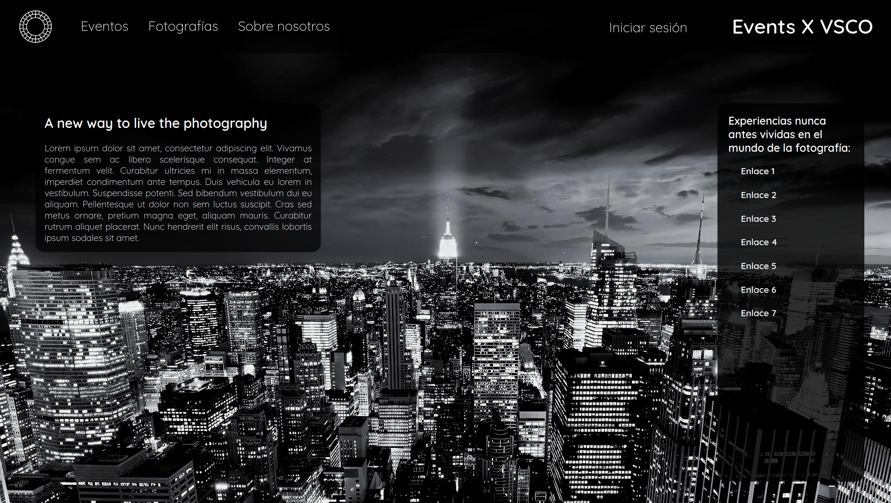

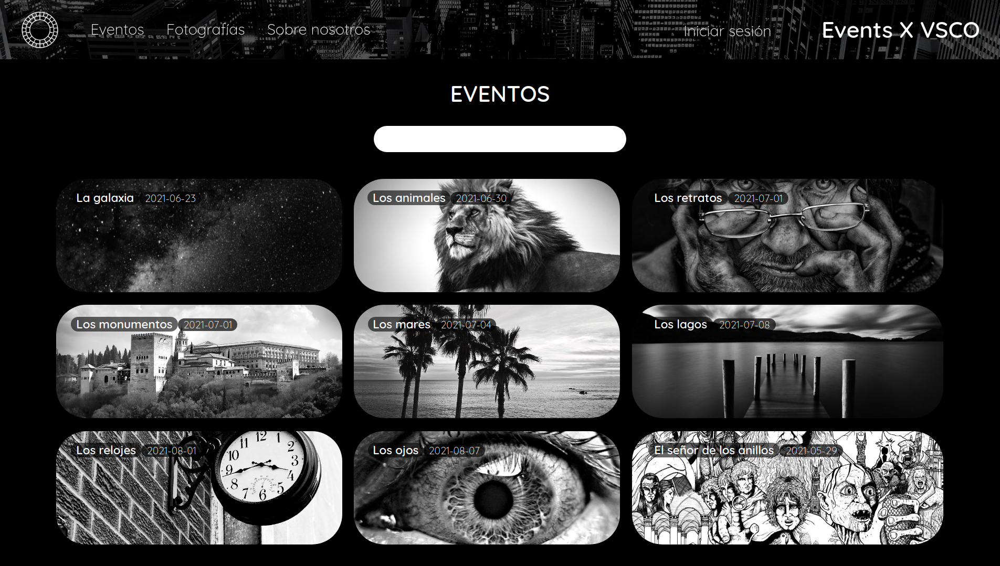

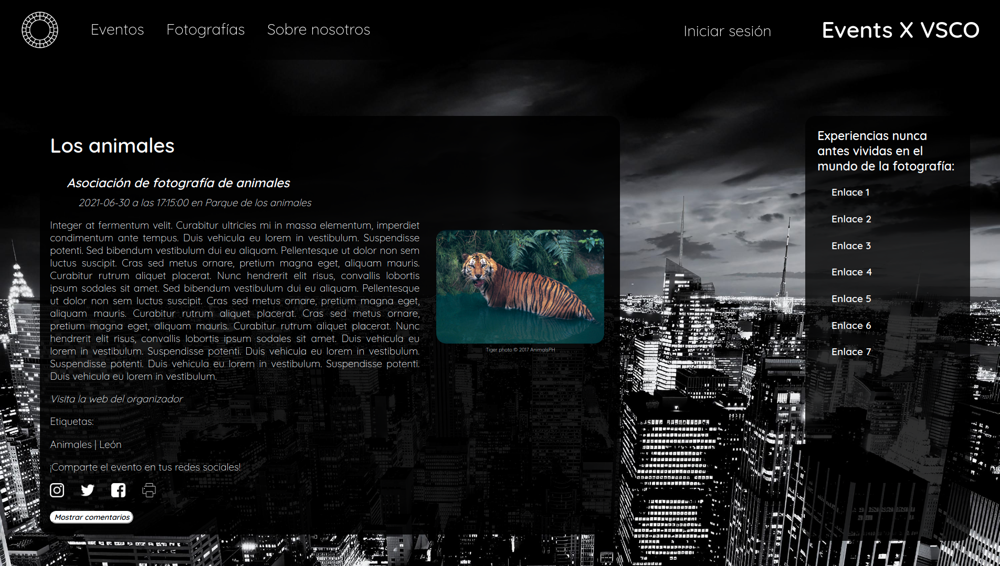

El diseño web se realizó teniendo en cuenta las diferentes funcionalidades requeridas por la aplicación. Debido a la estructura de las prácticas fue un proyecto incremental, por lo que las funcionalidades cambiaron con el paso del tiempo y el diseño se tuvo que ir adaptando, es decir, conforme la idea iba avanzando la web se iba rediseñando. No se pudo aplicar todo lo aprendido en la asignatura ya que en el momento de la realización no se sabían muchas de las cosas vistas a lo largo de la misma, por ello el diseño puede presentar algunas carencias.

Siempre he estado interesado en encontrar el sentido a las cosas que aprendo. En este caso, eso se refleja en aplicar lo aprendido en una situación diferente a la de la propia enseñanza de la materia. Gracias a que he estado cursando las asignaturas durante el mismo periodo de tiempo, he podido ir aplicando los conocimientos adquiridos de forma paralela a su aprendizaje, algo que considero realmente beneficioso para su correcta compresión y asimilación.

Realizar esta labor me ha permitido añadir un proyecto extra a mi experiencia. De esta forma, me he podido enfrentar a un doble proyecto, uno guiado en la propia asignatura y otro alternativo, propio y no guiado. Esta metodología de aprendizaje basado en proyectos me ha permitido adquirir todos los conocimientos teórico-prácticos de forma eficaz.

### Conclusiones
Evidentemente, en la descripción realizada de mi experiencia no están reflejadas todas las actividades llevadas a cabo a lo largo del curso, ya que por la longitud de este ensayo no ha sido posible. Sin embargo, he intentado destacar las actividades que me han parecido más interesantes y que, personalmente, me han aportado más tanto desde un punto de vista académico como desde, a lo que me podría referir como, un punto de vista profesional. He intentado complementar las actividades en los diferentes contextos con el objetivo de describir el mayor contenido del temario posible en relación con las mismas.

## Parte II: Caso de estudio. Web Yuzin
### Introducción
En esta segunda parte se va a realizar el análisis del caso de estudio propuesto con el objetivo de establecer una propuesta de mejora basada en evidencias. En base a la propuesta de mejora se elaborará una propuesta de diseño de la interfaz. De todo el conjunto de técnicas estudiado y aplicado a lo largo de la asignatura, se van a seleccionar algunas técnicas para realizar tanto el análisis como el rediseño, ya que no es posible aplicarlas todas debido al límite temporal de realización del mismo. Se va a justificar la selección estas técnicas, explicando por qué se han considerado adecuadas y qué aportan al estudio, en base a las buenas prácticas vistas en la asignatura y a las nuevas tendencias de diseño.

### Proceso seguido
Explicación del proceso seguido...

### Exposición del caso de estudio
[Yuzin](https://yuzin.com/ "Yuzin") es una agenda cultural, digital e impresa, de eventos como música, teatro, cine, baile, museos, etc. En sus inicios surgió con la idea de presentar revistas mensuales en formato físico promocionando las actividades culturales de las ciudades de Granada y Sevilla.

#### Exposición de la web y la revista antes del rediseño
##### Página web de inicio
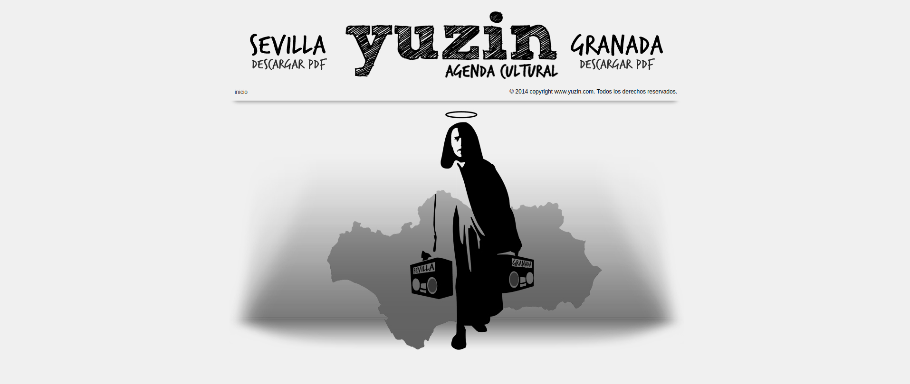
Obtenida vía [WayBackMachine](https://web.archive.org/web/20170521081537/http://yuzin.com:80/) de un snapshot del día 21 de mayo de 2017.

##### Páginas de revista
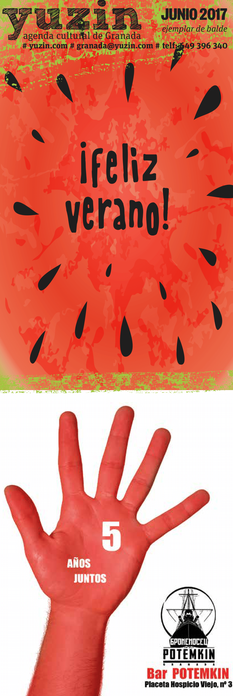 | 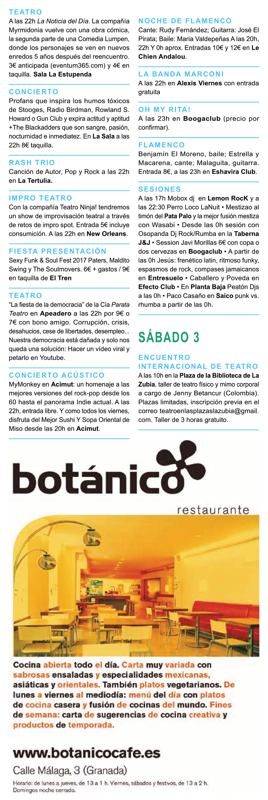 | 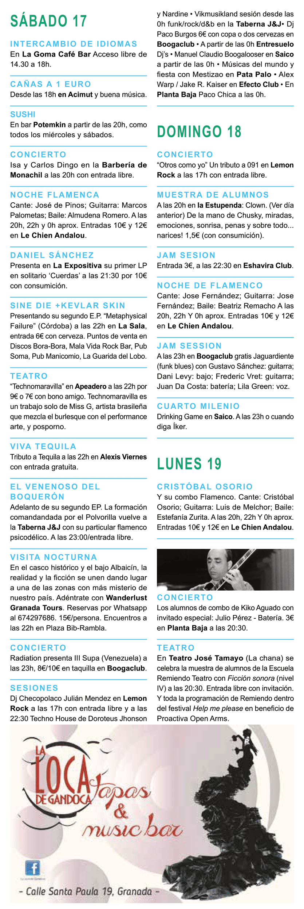 | 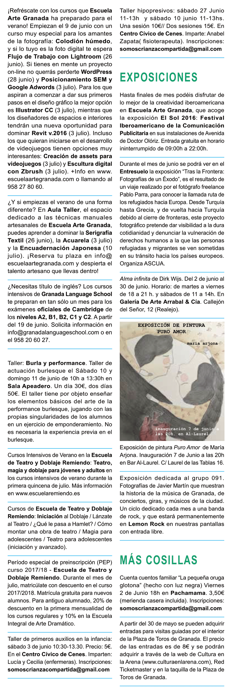 | 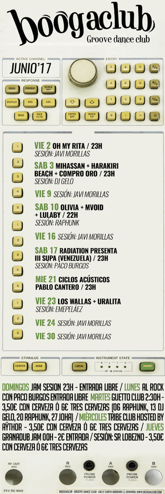
:----|----|----|----|----:

Obtenidas vía [WayBackMachine](https://web.archive.org/web/20170628084034/http://yuzin.com/revistagranada/yuzingranada.pdf) de un snapshot del día 28 de junio de 2017.

En un proceso renovador de transformación digital se rediseñó la web, dejando en un segundo plano la edición de la revista. 

#### Exposición de la web y la revista después del rediseño
##### Página web de inicio
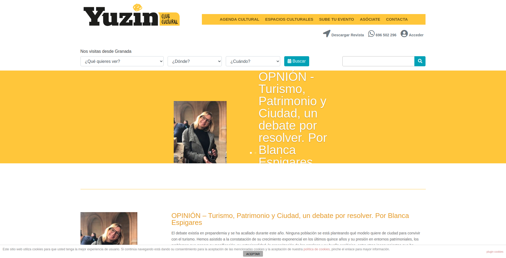
Obtenida vía [Yuzin](https://yuzin.com/).

##### Páginas de revista
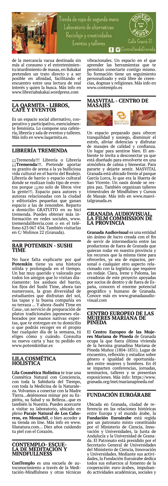 | 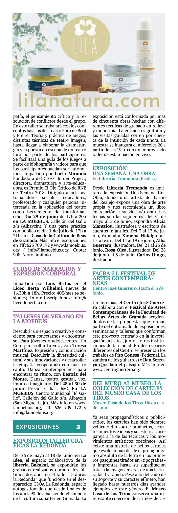 | 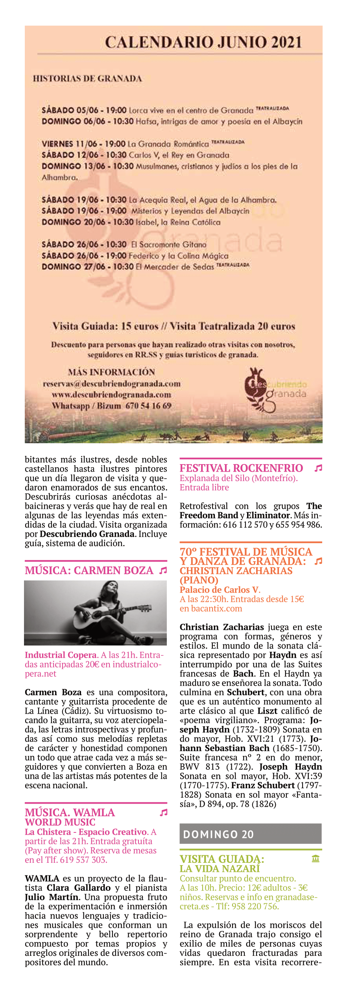 | 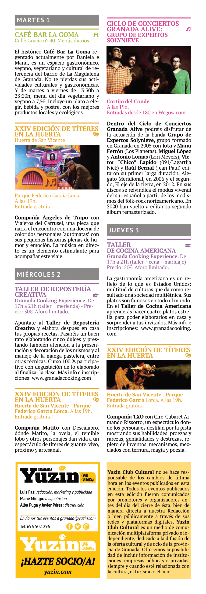 | 
:----|----|----|----|----:

Obtenidas vía [Yuzin](https://yuzin.com/wp-content/uploads/2021/06/YUZIN-GRANADA-junio-2021.pdf).

#### Hipótesis planteadas
- ¿Es adecuado el rediseño?
- ¿Se ha aplicado correctamente el rediseño para mejorar la experiencia de usuario?
- ¿Se mejoraría algo?
A estas hipótesis se les darán respuesta en los proceso evaluador y de rediseño. 

### Evaluación del caso de estudio

#### Usability Review

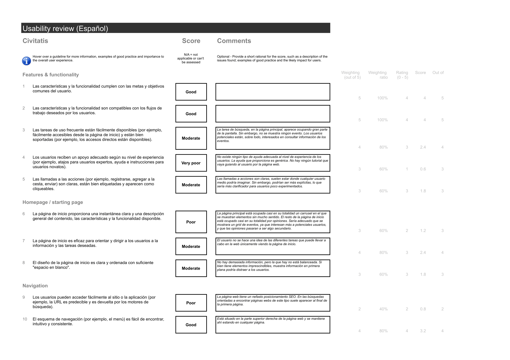

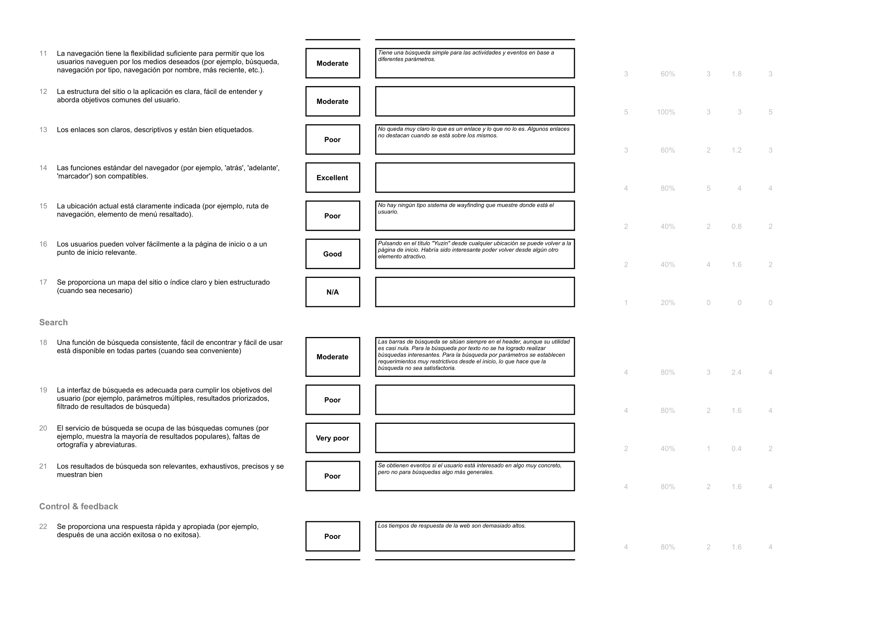

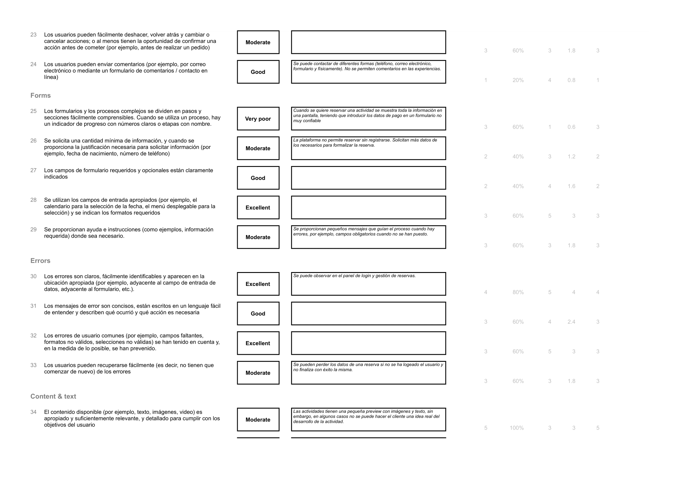

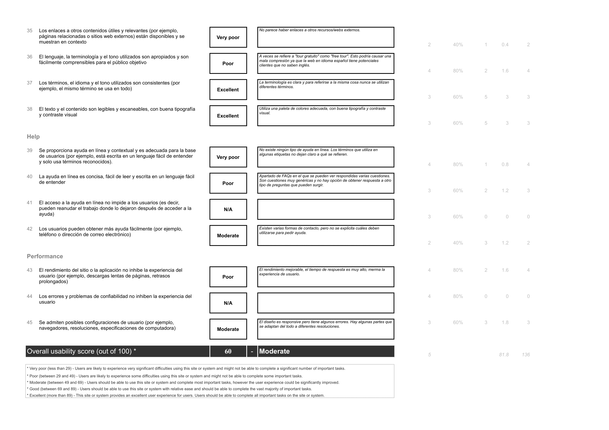

##### Enlaces al Usability Review

:link: [Yuzin-Usability-Review.pdf](doc/Yuzin-Usability-Review.pdf)

:link: [Yuzin-Usability-Review.xlsx](doc/Yuzin-Usability-Review.xlsx)

#### User Testing

| Nombre  | Género    | Edad | Ocupación  | Experiencia en internet | Plataforma                         | Perfil cubierto                                                                                 | Puntuación SUS |
|---------|-----------|------|------------|-------------------------|------------------------------------|------------------------------------------------------------------------------------------------|----------------|
| 🎭 Diego | Masculino | 43   | Productor   | Alta                    | Escritorio Windows - Móvil iPhone | Constantemente organiza eventos de diversa índole relacionados con el arte contemporáneo.   |        50         |
| 👵 Cayetana | Femenino  | 81   | Jubilada   | Baja                    | Móvil Android                       | Su distracción es la cultura. Aprende a navegar por internet. Le gusta ir a obras de teatro y espectáculos de baile flamenco. |      30         |
| 🧔 Pedro | Masculino | 27   | Actor | Muy Alta                    | Escritorio Linux                   | Es un bohemio de la vida. Siempre busca algo que hacer. Le gusta la poesía y todo lo relacionado con el arte escénico.               |        62.5         |
| 👩‍🎓 Ana | Femenino  | 22   | Estudiante | Alta                    | Móvil Android                      | Introvertida. En sus ratos libres disfruta reflexionando mientras observa exposiciones.     |    47.5    |

Estas cuatro personas se han elaborado basándose en personas cercanas de mi entorno, que suelen intesarse por diversos eventos culturales en la ciudad de Granada, tanto desde el punto de vista de organización como desde el punto de vista del consumidor.

- *Diego*, productor, tiene un perfil que aporta experiencia para con las funcionalidades no tan comunes en el uso de estos productos. Gracias a esto, se ha podido identificar carencias variadas asociadas a un mal diseño del producto con relación a la parte organizativa y de inclusión de eventos.

- *Cayetana*, jubilada, tiene un perfil que aporta inexperiencia en el uso de las nuevas tecnologías. Por ello, ha sido útil que realizara la valoración, teniendo como objetivo encontrar las deficiencias de diseño que pueden afectar a personas que no se desenvuelven del todo bien en estos entornos. Además, había utilizado la revista de Yuzin en numerosas ocasiones. Su valoración ha permitido saber si la transformación digital realizada alcanza a personas de esta edad.

- *Pedro*, actor, tiene un perfil que aporta conocimiento sobre el mundo del espectáculo y la cultura. Esto ha permitido identificar puntos a reestructurar en relación a las tendencias y experiencias más novedosas.

- *Elena*, estudiante, tiene un perfil que es muy común en la utilización de este tipo de productos. Esto ha sido útil para identificar los diferentes insights en relación al interés en un único tipo de experiencia.

#### System Usability Scale Test (SUS)

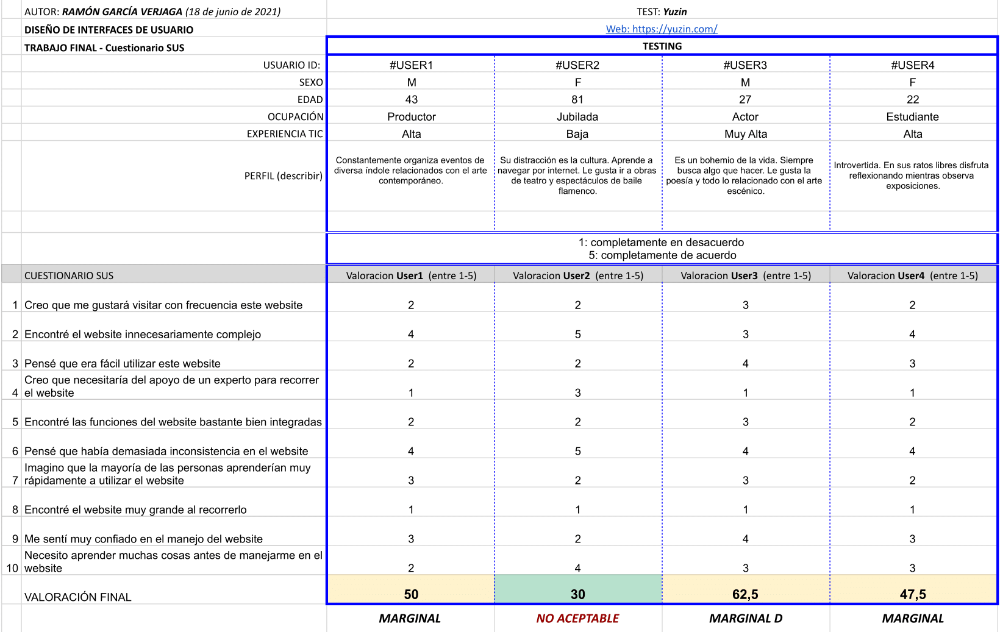

##### Enlaces al test de usabilidad System Usability Scale Test

:link: [Yuzin-System-Usability-Scale-Test.pdf](doc/Yuzin-System-Usability-Scale-Test.pdf)

:link: [Yuzin-System-Usability-Scale-Test.xlsx](doc/Yuzin-System-Usability-Scale-Test.xlsx)

#### Usability Report

#### Propuesta de Mejora

### Rediseño del caso de estudio

#### Moodboard y Guía de Estilo

#### Mockup

#### Landing Page

### Conclusiones del caso de estudio

### Referencias

## Conclusiones de la asignatura
Habiendo finalizado todo el trabajo, me gustaría hacer una última valoración de lo que me ha aportado la asignatura.

A modo general, el compendio de ejercicios y actividades desarrollados a lo largo de la asignatura me ha permitido adquirir una visión global del proceso que se lleva a cabo en la realización de un diseño centrado en el usuario. Con respecto a esta visión global, he logrado comprender cómo se interrelacionan las partes creativa y técnica de un proyecto. A veces es difícil concebir los proyectos como un todo, ya que, por regla general, nuestros estudios se centran en la parte más técnica de la creación de un producto software. Aprender los conocimientos de esta materia me ha hecho establecer relaciones entre el diseño de interfaces de usuario y las técnicas de desarrollo de software.

De forma algo más específicia, la asignatura me ha enseñado a aplicar los principios de diseño que permiten que una interfaz sea usable en sus diferentes niveles. También, me ha aportado experiencia sobre las técnicas y estilos de interacción tanto básicos como avanzados y su integración para con las interfaces de usuario. A lo anterior, puedo añadir que me ha dado la capacidad para evaluar propiedades de calidad tan importantes como la usabilidad y la accesibilidad y las herramientas necesarias para ello.

Con respecto a la adquisición de *soft skills*, me ha permitido perfeccionar las técnicas de trabajo en equipo, usando metodologías como [Kanban](https://kanbanize.com/es/recursos-de-kanban/primeros-pasos/que-es-kanban) para el reparto de tareas. Además, he entrenado el pensamiento crítico y la empatía, elaborando evaluaciones desde un punto de vista imparcial y realizando juicios de valor desde el punto de vista de usuarios ficticios. 

Concluyo con una valoración muy positiva de los conocimientos adquiridos. Pienso, francamente, que gracias a esta asignatura soy capaz de valorar las necesidades del usuario en cuanto al diseño se refiere, sabiendo identificar y especificar los requisitos para satisfacer estas necesidades. Además, en base a estas valoraciones, soy capaz de diseñar soluciones apropiadas en diferentes dominios de aplicación utilizando herramientas específicas, siguiendo buenas prácticas de creación de productos.
